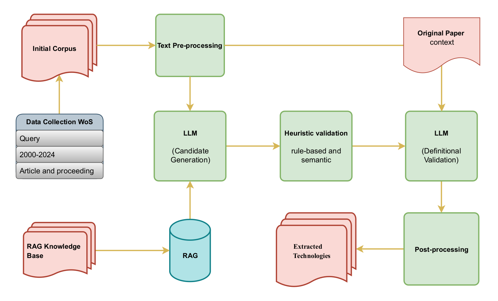

# RATE

**This is the implementation of our paper ["RATE: An LLM-Powered Retrieval Augmented
Generation Technology-Extraction Pipeline"](https://arxiv.org/pdf/2507.21125).**

In an era of radical technology transformations, technology maps play a crucial role in enhancing decision making. These maps heavily rely on automated methods of technology extraction. This paper introduces Retrieval Augmented Technology Extraction (RATE), a Large Language Model (LLM) based pipeline for automated technology extraction from scientific literature. RATE combines Retrieval Augmented Generation (RAG) with multi-definition LLM-based validation. This hybrid method results in high recall in candidate generation alongside with high precision in candidate filtering. While the pipeline is designed to be general and widely applicable, we demonstrate its use on 678 research articles focused on Brain-Computer Interfaces (BCIs) and Extended Reality (XR) as a case study. Consequently, The validated technology terms by RATE were mapped into a co-occurrence network, revealing thematic clusters and structural features of the research landscape. For the purpose of evaluation, a gold standard dataset of technologies in 70 selected random articles had been curated by the experts. In addition, a technology extraction model based on Bidirectional Encoder Representations of Transformers (BERT) was used as a comparative method. RATE achieved F1-score of **91.27%**, Significantly outperforming BERT with F1-score of **53.73%**. Our findings highlight the promise of definition-driven LLM methods for technology extraction and mapping. They also offer new insights into emerging trends within the BCI-XR field. 

<div align=center>

</div>


## Run
### 1. Clone Repository
```bash
$ git clone https://github.com/AryaAftab/RATE.git
$ cd RATE/
```
### 2. Requirements
```bash
$ pip install -r requirements.txt
```

### 3. Data for RAG System
Data structure for the RAG system should follow an specific format:
it should be a ```json``` file, the following example shows a single entry of such ```json``` file.
```bash
[
  {
    "unique_id": "tech-249",
    "name": "LapSim",
    "type": "Technology",
    "domain": "Surgical Simulation & VR Training Software",
    "tags": [
      "LapSim",
      "surgical simulator",
      "VR surgical training",
      "laparoscopy training",
      "medical simulation software"
    ],
    "description": "A virtual reality surgical simulation program specifically designed for laparoscopic surgery training. Aims to improve basic coordination, instrument handling, and procedure-based skills with haptic feedback.",
    "applications": [
      "Training medical students and surgeons in laparoscopic procedures",
      "Improving surgical skills and task completion time",
      "Practicing surgery without risk to real patients"
    ],
    "related": [
      "Medical virtual reality (from previous lists)",
      "Surgical simulation (general concept)",
      "Haptic technology"
    ],
    "source": "Wikipedia"
  }
]
```

**Note:** An example of the required ```json``` format is provided in the [RAG_Knowledge_Base_Example.json](./Data/RAG_Knowledge_Base_Example.json). 

### 4. Set configurations in config file:
You only need to change the constants in the [config.py](./config.py) to set the needed configurations based on your experiment.

### 5. Usage
After setting the configurations, use the following code to create your data vector that will be used in RAG system.
- Note: The data vector for the RAG system only needs to be created once.
```python
from data_vector import create_retriever

create_retriever()
```

After the creation of the data vector, the following snippet can be used for the task of retrieving.
```python
from data_vector import load_retriever

retriever = load_retriever()
docs = retriever.invoke("Ultrasoft microwire neural electrodes improve chronic tissue integration")
```
#### Technology extraction pipline:
- The domain in which the extraction of technology is taking place must be set.
- The manual technology filter can be set to prevent extraction of specific technologies.


```python
DOMAIN_FOR_EXTRACTION = "AR and VR in BCI"

TECHNOLOGY_FILTER = {}
if "AR and VR in BCI" in DOMAIN_FOR_EXTRACTION or "Extended Reality" in DOMAIN_FOR_EXTRACTION:
    TECHNOLOGY_FILTER["generic_terms"] = [
        "system", "method", "device", "apparatus", "component", "module", "platform",
        "display", "sensor", "tracker", "renderer", "engine", "interface",
        "imaging", "visualization", "simulation", "diagnostic tool", "surgical navigation"
    ]
    TECHNOLOGY_FILTER["common_words"] = [
        "health", "medical", "patient", "care", "clinical", "surgery", "diagnosis",
        "application", "data", "user", "wearable"
    ]
    TECHNOLOGY_FILTER["forbidden_tech"] = [
        "miracle cure (marketing)", "revolutionary breakthrough (vague)"
    ]
```

An example of provided text for the technology extraction:
```python
from technology_extraction import TechnologyExtractor

technology_extractor = TechnologyExtractor(TECHNOLOGY_FILTER, DOMAIN_FOR_EXTRACTION)

## Example text
text = 'Efforts to study the neural correlates of learning are hampered by the size of the network in which learning occurs. To understand the importance of learning-related changes in a network of neurons, it is necessary to understand how the network acts as a whole to generate behavior. Here we introduce a paradigm in which the output of a cortical network can be perturbed directly and the neural basis of the compensatory changes studied in detail. Using a brain-computer interface, dozens of simultaneously recorded neurons in the motor cortex of awake, behaving monkeys are used to control the movement of a cursor in a three-dimensional virtual-reality environment. This device creates a precise, well-defined mapping between the firing of the recorded neurons and an expressed behavior (cursor movement). In a series of experiments, we force the animal to relearn the association between neural firing and cursor movement in a subset of neurons and assess how the network changes to compensate. We find that changes in neural activity reflect not only an alteration of behavioral strategy but also the relative contributions of individual neurons to the population error signal.'

technologies_info_list = technology_extractor.extract_technologies(text)
```
Results from the provided example:
```python
['brain-computer interface',
 'population error signal',
 'three-dimensional virtual-reality environment']
```

## Gold Standard Dataset
- BCI and XR publications that extracted from Web of Science(Wos) is provided in the [BCI_XR_W0S_Publications_Corpus.xlsx](./Data/BCI_XR_W0S_Publications_Corpus.xlsx) 
- List of extracted technologies by BERT and RATE for the gold standard dataset is provided in the [Gold_Standard_Technology_List.xlsx](./Data/Gold_Standard_Technology_List.xlsx) 

## Citation

If you find our code useful for your research, please consider citing:
```bibtex
@article{mirhosseini2025rate,
  title={RATE: An LLM-Powered Retrieval Augmented Generation Technology-Extraction Pipeline},
  author={Mirhosseini, Karan and Aftab, Arya and Sheikh, Alireza},
  journal={arXiv preprint arXiv:2507.21125},
  year={2025}
}
```
